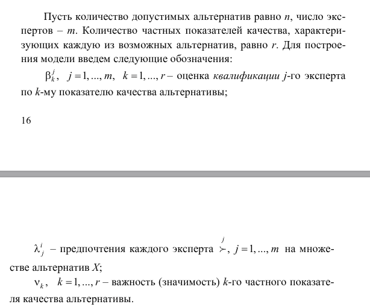

# Коллективное принятие решений

[**Ссылка на лекцию (книга)**](https://reader.lanbook.com/book/161064#18)  
будем в качестве основной организационной формы рассматривать комитет (создается некая группа из экспертов, отвечающих за различные сферы влияния, и на которых возложена задача в разных ситуациях принимать решения)

## Общя мат.постановка

- X - конечное множество альтернатив
- x$_{j}$ $\in$ X, j = 1...n
- J$^{i}$$_{k}$, k = 1...r - численное значение k-го частного показателя
- m - количество экспертов
-i - предпочтения каждого эксперта для множества альтерн

требуется найти некое коллективное решение (Наилучшую альтернативу)
Показатели максимизируем  
**Все современные методы делятся на две группы:**

1. Методы голосования
2. Методы многокритериального выбора

### Модели голосования

1. Модель Кондорсе - кандидат, который побеждает каждого попарно - побеждает  
l(x$_{j}$,x$_{k}$)>l(x$_{k}$,x$_{j}$)  
основная проблемма - парадокс Кондорсе, когда A>B>C>A => решения нет, требуется переголосование

2. Модель Борда - результаты голосования переводят в баллы.  
b(x$_{j}$)=$\sum$(l(x$_{j}$,x$_{k}$) - l(x$_{k}$,x$_{kj}$)).  
За первое место присуждают n баллов, за второе n-1 баллов и т.д.
Возможен вариант, что одинаковое количество баллов, тогда только для них требуется уточнение, а не для всех вариантов

## Модели многокритериального выбора при принятии коллективных решений

### Метод ранжирования частных критериев

Пусть экспертиза проводится группой из L экспертов, которые являются квалифицированными специалистами в той той области, где принимается решение. Метод ранжирования заключается в том, что каждого эксперта просят расставить частные критерии в порядке их важности

### Линейная модель многокритериального выбора

## Многокритериальная модель выбора на основе теории нечетких множеств

### Некоторые понятия теории нечетких множеств. Индексы ранжирования

Нечеткое множество – это математическая модель классас нечеткими или, иначе говоря, размытыми, границами. В этом по-нятии учитывается возможность постепенного перехода от принад-лежности к непринадлежности элемента множеству. Иными слова-ми, элемент может иметь степень принадлежности множеству меж-ду полной принадлежностью («1») и полной непринадлежностью(«0»). Если степень принадлежности обозначить $\mu$, то $\mu$ $\in$ [0,1]

## Раздел 3. Нейросети
