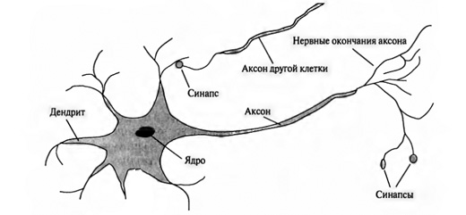
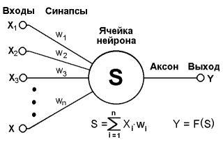
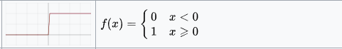
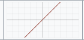
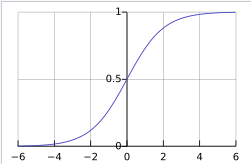
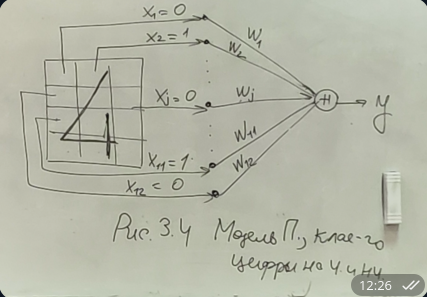
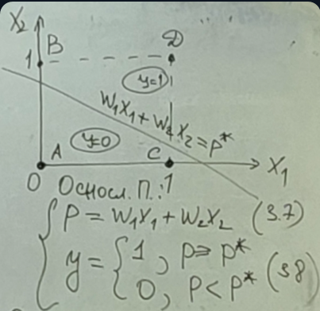
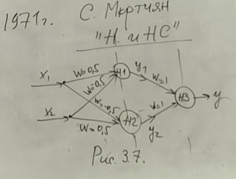
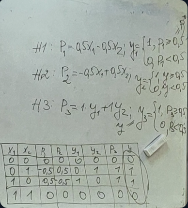
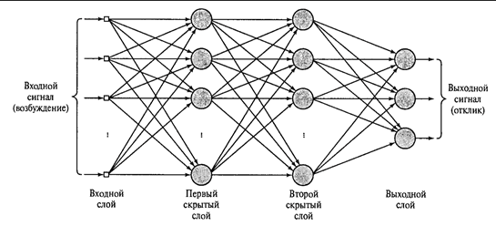

# Часть 3. Основы нейросетевого моделирования

## Стратегии развития искуственного интелекта

искуственный интелект развивается по 3 стратегиям:  

1) Стратегия высокого уровня (использование экспертных систем, основанных на знаниях)
2) Стратегии среднего уровня (Основаны на использовании эволюционного подхода)
3) Низкоуровневе стратегии (Стратегии, основанные на моделировании работы человеческого мозга)

## 3.1. Модель искуственного нейрона

Искуственная нейронная сеть - это упрощенная модель биологического мозга человека, точнее его нервной ткани. Естественная нервная клетка, называемая нейроном, состоит из тела, содержащего ядро и отростков - дендритов, по которым в нейрон поступают входные сигналы.
  
Один из отростков служит для передачи выходных сигналов другим нервным клеткам (аксон), соединение аксона с дендритом другого нейрона называеттся синапсом. Сигнал передается другому нейрону только при возбужденном состоянии нейрона, это происходит, когда число возбуждающих дендритов превосходит число тормозящих.
После того как нейрон возбуждается, он передает сигнал другому нейрону, и дальше все по цепочке происходит возбуждение, и мозг начинает работать на полну, для решения этой задачи.  

Аналогично устроенна искуственная нейронная сеть представляет совокупность простых выч. элементов, каждый из которых обладает множеством входов и одним выходом, соединяющим его с другими нейронами.  
  
Есть функция возбуждения, которая преобразует входные сигналы в выходной.  

p = $\sum_{i=1}^{n}$(w$_{i}$,x$_{i}$)  - потенциал нейрона (3.1)

### Функции возбуждения  

В настоящее время используется 3 вида функции возбуждения (выбирается всегда в зависимости от вида решаемой задачи):  

1) Ступенчатая  
  
2) Линейная функция y=kp  
  
3) Сигмоидальная функция  (y = 1/e^(-kp))  
  

## 3.2 Модели НС

Первая модель относится к середине прошлого века. У. Мак-Каллок и В. Питс в 1953году выдвинули идею, что если искуственные нейроны соединить между собой проводами и пустить по ним ток, то такой искуственный мозг сможет решать интелектуальные задачи. Эта идея была подтвержена Розенблаттом в 1958 году, который создал компьютерную программу, имитирующую работу нейронов, эта программа былан названа персептрон. В 1960 году Розенблатт смонтировал электронное устройство, в котором функции отдельных нейронов выполняли специальные электронные схемы, работающие на лампах - получился первый нейрокомпьютер, способный распозновать буквы.

### Распознование числа (задача классификации чисел на четные и нечетные)

  
Надо найти такие веса, при которых эта НС будет определять четная или не четная цифра попала в рамку  
Согласно формуле 3.1 нерон выполняет суммирование входных сигналов xj помноженных на веса wj. Розенбладд задал пороговую функцию возбуждения:

``` formula
y = 1, p>=p*
  = 0, p<p*
```

### Алгоритм решения

1. Задал начальное распределение весов случайным образом
2. Корректировал веса путем увеличения тех, которые способствовали возбуждению нейрона при правильном значении y

Получился след. итерационный алгоритм:

1) Случайно задаются w$_{j}$ и p*
2) Показать цифру и системой фотоэлементов сформировать вектор x$_{j}$
3) Нейрон выполняет взвешенное сумирование, определяет потенциал (p) и вырабатывает выходной сигнал (y)
4) а) Если y - правильно, то сразу переходим на шаг 2  
   b) если y не правильно и равен 0, то надо увеличить веса всех активных входов по формуле  
w$_{j}$(t+1) = w$_{j}$(t) + x$_{j}$ (3.2)  
t - N итераций  
   с) w$_{j}$(t+1) = w$_{j}$(t) - x$_{j}$ (3.3)
5) Перейти на шаг 2

В приведенном алгоритме шаги 4.b и 4.c называются правилами Хэба в честь канадского физиолога, учавствовавшего в разработке данного алгоритма. Этот алгоритм напоминает процеесс обучения ребенка методом поощрения и наказания.  
Этот алгоритм показал положительный результат и такая простая нейросетевая модель делила числа на четные и нечетные.  
Рассмотрим алгоритм обучения персептрона с помощью правил Хэбба в более общем виде. Обозначим y$^{-}$-требуемый выходной сигнал, $\Epsilon$ = y$^{-}$ - y.  


$\Epsilon$ = 0 => Шаг алг. 4a  
$\Epsilon$ > 0 => Шаг алг. 4b  
$\Epsilon$ < 0 => Шаг алг. 4с


w$_{j}$(t+1) = w$_{j}$(t) + $\Delta$ w$_{j}$  (3.4)  
$\Delta$ w$_{j}$=$\Epsilon$*x$_{j}$ (3.5)  
В итер. процесс 3.4 полезно ввести коэффициент скорости обучения, если $\eta$ > 1 процесс быстрее но менее устойчив, $\eta$  < 1 - процесс стабильнее но медленнее. Установили, что 0.05<$\eta$ <1.5  

### Теорема 3.1 Арнольда-Колмогорова

Если существует множество значений весов, которые обеспечивают требуемое распознование образа, то в конечном образе алгоритм обучения 3.4-3.5 приводит либо к этому множеству, либо к другому множеству, такому, что требуемое распознование образа будет достигнуто.

Следствия:

1) Решение существует невсегда
2) Решение может быть не единственно

## Ограничения однослойного персепторона

Песептрон не мог решить многие инт.задачи, так как при росте числа итераций $\Epsilon$ не стремилось к 0.  
y=(x$_{1}$ AND NOT x$_{2}$ ) OR (x$_{2}$ AND NOT x$_{1}$)  
y = 1 если x$_{1}$ = 1 or x$_{2} = 1  
y = 0 в общем случае

|   | x1 | x2 | y |
|---|----|----|---|
| A | 0  | 0  | 0 |
| B | 0  | 1  | 1 |
| C | 1  | 0  | 1 |
| D | 1  | 1  | 0 |



Согласно таблице в точке A и D y = 0, а в точках B и C y = 1 => как не обучай персептрон, функцию 3.6 нельзя смоделировать (пример линейно неразделимой задачи)

## 3.4. Песептрон со скрытым слоем нейронов

  
  

## 3.5 Многослойный персептрон. Теорема существования

Рассмотрим многослойный песептрон с 2 скрытим слоями  
  
