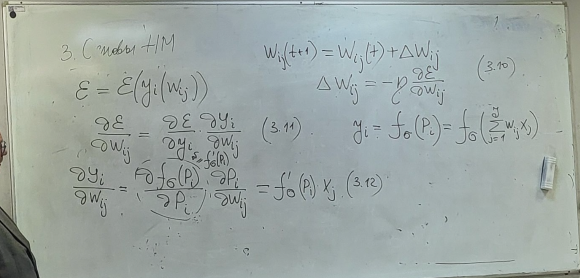
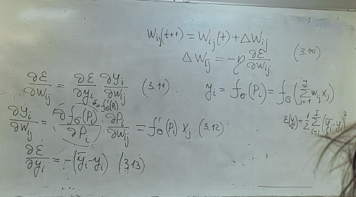
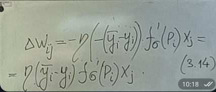
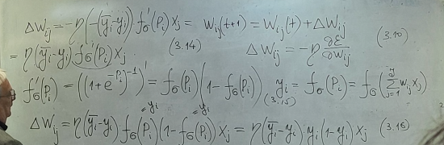
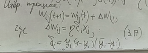

# Лекция 23.12.2025

## Вывод алгоритм для решения задачи 3.9

w$_{ij}$(t+1) = w$_{ij}$(t) + $\Delta$w$_{ij}$  
$\Delta$w$_{ij}$=-$\eta$*$\delta$E/$\delta$w$_{ij}$

Подставляем 3.12 и 3.13 в 3.10

итерационный процесс 3.10 при обучении однослойного персептрона будет следующий:

  
алгоритм 3.17 обычно называют обобщенным delta-правилом  
$\Delta$$_{i}$ называют нейросетевой ошибкой

## Замечания

- Данный алгоритм обладает быстрой сходимостью, на порядки превосходящей правило Хэбба
- Для ускорения можно ортимальным образом считать коэффициент $\eta$. Обычно используют метод Адамса (какой-то вариант метода золотого сечения)
- Есть проблемы единственности решения и другие проблемы решения задачи нелинейного програмирования
- этот же метод применяется для обучения многослойных сетей, процесс проводится на каждом слое, начиная с последнего
- почледнее время фреймворки и нейросети являются уже обученными, можно взять и считать предобученной и дообучать, но это не всегда хорошо, можно уйти не туда